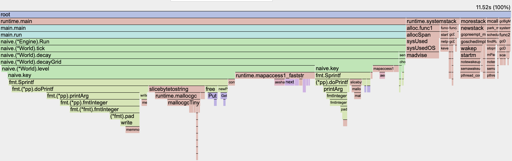
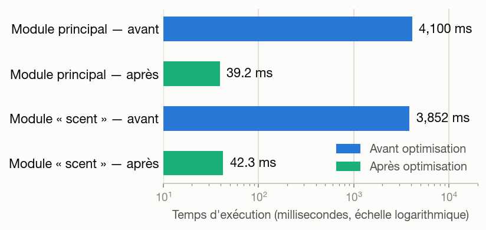
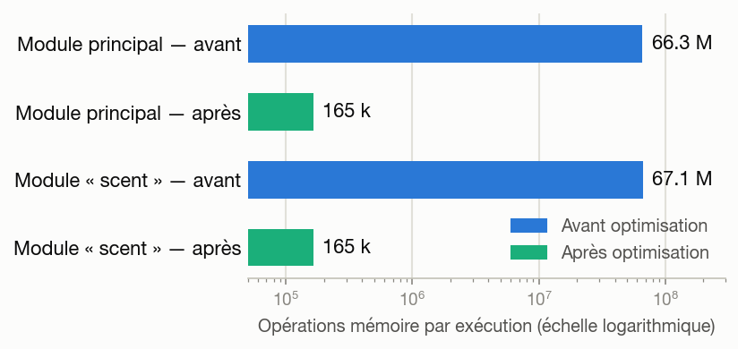
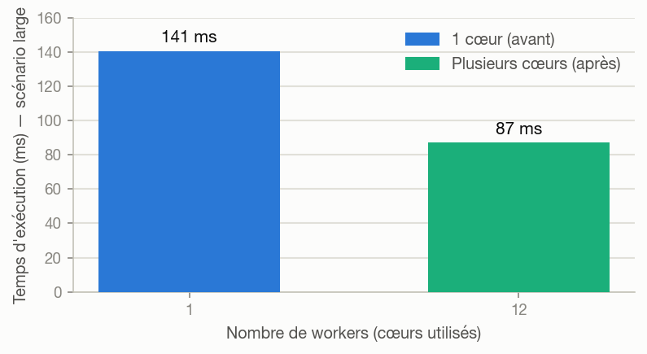
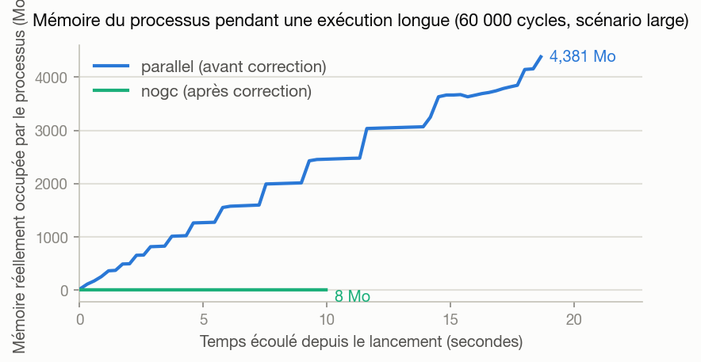
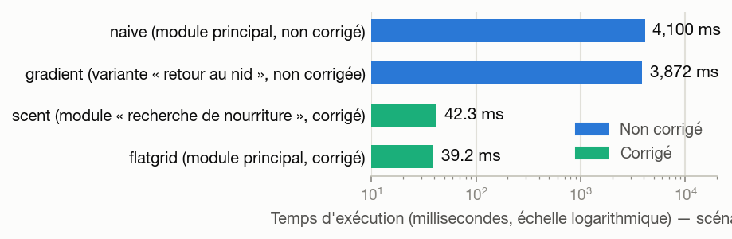

# Synthèse des optimisations de performance

**Simulation de colonie de fourmis — module de calcul backend**

## Contexte matériel

| | |
|---|---|
| Processeur | Apple M4 Pro — 12 cœurs |
| Mémoire | 24 Go |
| Système | macOS |
| Runtime | Go 1.26.4 |

---

## Résultats — les chiffres

### Optimisation n°1 — Adressage de la grille

| Module | Temps — avant | Temps — après | Opérations mémoire — avant | Opérations mémoire — après |
|---|---:|---:|---:|---:|
| Module principal | 4,10 s | **39,3 ms** | 66,3 millions | **165 300** |
| Module « recherche de nourriture » | 3,85 s | **42,3 ms** | 67,1 millions | **165 100** |

**Vérification indépendante** (compteurs matériels du processeur, module principal) :

| Compteur matériel | Avant | Après | Rapport |
|---|---:|---:|---:|
| Instructions CPU exécutées | 93,06 milliards | 1,28 milliard | ×72,5 |
| Cycles d'horloge consommés | 18,47 milliards | 0,19 milliard | ×96,0 |
| Mémoire occupée au pic | 19,4 Mo | 10,6 Mo | ×1,8 |

### Optimisation n°2 — Parallélisation multi-cœurs

| Métrique (scénario `large`, 256×256) | Avant (1 cœur) | Après (12 cœurs) |
|---|---:|---:|
| Temps d'exécution | 134 ms | **87 ms** |

### Optimisation n°3 — Résolution d'une fuite de mémoire

Sur 60 000 cycles (`large`) : 26 Mo → **4,4 Go** en moins de 19 s avant correction ; stable à 8 Mo après.

| Métrique (scénario `large`, 300 cycles) | Avant | Après | Rapport |
|---|---:|---:|---:|
| Nombre d'allocations mémoire | 1 506 703 | **19** | ≈79 300× |
| Mémoire allouée au total | 26,1 Mo | **16 Ko** | ≈1 624× |

### Vue d'ensemble cumulative — module principal, les 4 étapes, même scénario

| Étape | Stratégie | Temps d'exécution | Mémoire allouée | Allocations | Δ vs étape précédente |
|---|---|---:|---:|---:|---:|
| `naive` | Référence : clé texte (`fmt.Sprintf`) + `map[string]uint32`, un seul cœur | 12,25 s | 1,52 Go | 200 333 979 | — |
| `flatgrid` | Suppression de la clé texte et de la `map` → tableau indexé | **130,6 ms** | **26,1 Mo** | **1 506 705** | ×93,8 temps, ×133 allocations |
| `parallel` | + worker pool sur 12 cœurs | **87,1 ms** | 26,1 Mo (inchangée) | 1 506 703 (inchangées) | ×1,50 temps |
| `nogc` | + suppression de l'historique inutile (`Ant.Trail`) | **50,6 ms** | **16 Ko** | **19** | ×1,72 temps, ×79 300 allocations |
| **Total cumulé** | `naive` → `nogc` | **×242 plus rapide** | **×95 000 moins de mémoire allouée** | **×10,5 million de fois moins d'allocations** | — |

---

## Interprétation des résultats

- **Le gain vient d'arrêter de gâcher des ressources, pas d'en ajouter.** La correction n°1 (algorithmique, zéro ressource ajoutée) fait ×93,8 à elle seule. Les corrections n°2 et n°3, qui ajoutent des cœurs puis suppriment un gaspillage mémoire, n'apportent « que » ×1,5 et ×1,7 — et seulement une fois n°1 en place. Paralléliser la version d'origine telle quelle n'a pas été testé, mais son profil ne suggère rien de mieux : le même goulot (la `map`) domine quel que soit le nombre de cœurs.
- **Le gain se multiplie, il ne s'additionne pas.** ×242 = 93,8 × 1,5 × 1,72, pas leur somme. Chaque correction s'applique à un programme déjà plus rapide, donc son effet relatif grandit.
- **Les trois corrections n'ont pas la même nature.** Les deux premières se lisent sur un chronomètre. La troisième (fuite mémoire) a un gain de vitesse modeste (×1,7) ; sa vraie valeur est la **stabilité** — sans elle, une exécution longue épuise la mémoire disponible et provoque un arrêt, indépendamment de la vitesse. Seul le suivi dans le temps (graphique de l'optimisation n°3, plus bas) la révèle.

---

## Diagnostic

**Outil** : `pprof`, le profileur intégré à Go — il échantillonne le programme en cours d'exécution des milliers de fois par seconde et note la ligne active à chaque fois. Résultat : un classement des fonctions par temps réellement consommé, mesuré, pas estimé.

La grille (murs, nourriture, traces chimiques) était stockée dans des `map`. Lire une case exigeait de construire une clé texte (ex. `"42,17"`) via `fmt.Sprintf`, puis de chercher cette clé dans la `map`. `pprof` chiffre ce coût : **76 % du temps CPU total**, plus que toute la logique de déplacement réunie. Ligne par ligne (`pprof -list`) : la construction de la clé (`naive.go:105`) consomme **55,6 %** à elle seule ; la recherche dans la `map` en ajoute **20,8 %**.

> ## 76 %
> du temps CPU total consommé par la construction de clé texte et la recherche `map`.

La tour verte (gauche) est la chaîne de construction de clé (`naive.key` → `fmt.Sprintf`) — plus de la moitié de la largeur du graphique à elle seule. Les blocs roses (droite) sont la recherche `map` et le nettoyage mémoire qu'elle déclenche. La logique utile de la simulation est trop étroite pour être visible à cette échelle.

**Confirmation par chronométrage isolé** (`go test -bench` + `benchstat`) : lire une case par `map` contre lire la même case par calcul d'index direct.

| Méthode de lecture d'une case | Temps par lecture |
|---|---:|
| Par `map` (clé texte) | 52,96 ns |
| Par index direct | **0,313 ns** |

**169× plus lent**, hors de toute simulation. Trois mesures indépendantes (pourcentage `pprof`, arbre d'appel, chronométrage isolé) pointent la même cause — c'est ce diagnostic qui a guidé la correction n°1.

---

## Explications — comment et pourquoi

### Optimisation n°1 — Adressage de la grille

Deux modules partageaient le même problème : le module principal, et le module « recherche de nourriture » (permet à une fourmi de sentir un tas de nourriture à proximité), construit avant cette correction et n'en ayant donc pas bénéficié. Même cause, même correction appliquée aux deux.

**Changement** : suppression de la clé texte (`fmt.Sprintf`), remplacement de chaque `map` de la grille par un tableau simple adressé par calcul d'index direct. Aucune autre logique modifiée — même ordre de traitement, mêmes règles, même hasard contrôlé. Résultat : opérations mémoire divisées par plus de 400 sur les deux modules.

La vérification par compteurs matériels (`time -l`) confirme le gain par une voie indépendante de `pprof`. Elle révèle un point notable : avant correction, le temps CPU consommé (4,25 s) dépassait le temps réel écoulé (3,94 s) — le nettoyage mémoire automatique de Go tournait en tâche de fond sur un second cœur, à cause du volume d'opérations mémoire. Après correction, ce second cœur n'est plus sollicité.

### Optimisation n°2 — Parallélisation multi-cœurs

Après les deux premières corrections, le programme restait mono-cœur sur une machine qui en propose douze.

**Changement** : un groupe fixe de *workers* (jusqu'à 12) démarre une fois au lancement et se réutilise à chaque cycle. Le travail parallélisable (réflexion des fourmis, évolution des traces chimiques) leur est réparti. Une étape reste série à dessein : le dépôt effectif sur le plateau (ramassage, retour au nid, marquage chimique) doit se faire fourmi par fourmi pour trancher les conflits — c'est le **chemin critique** identifié au diagnostic, seule partie non parallélisable.

Douze cœurs ne donnent pas douze fois plus vite, seulement ×1,6 : au-delà d'un certain nombre de cœurs, c'est le chemin critique, pas le calcul, qui borne le temps.

### Optimisation n°3 — Résolution d'une fuite de mémoire

Sur une exécution longue, la mémoire occupée augmentait en continu sans jamais se stabiliser.

**Cause** : chaque fourmi conservait l'historique complet des cases visitées depuis le début, dans une liste qui ne fait que grandir — ajoutée à une étape antérieure du projet, jamais relue, jamais nettoyée.

**Changement** : suppression de cette liste. Rien d'autre modifié. Effet secondaire favorable : cette liste alimentait le chemin critique (étape série de l'optimisation n°2), qui devient lui-même plus court. Résultat à 12 cœurs : **50,6 ms**, contre 87 ms précédemment et 134 ms au départ — ×1,7 supplémentaire, ×2,7 depuis le tout premier module.

---

## Méthode

| Outil | Rôle | Ce qu'il a montré ici |
|---|---|---|
| `pprof` | Profilage CPU/mémoire réel, ligne de code exacte. | Cible à corriger : `naive.key` + la `map`, 76 % du CPU (Diagnostic). |
| `go test -bench` + `benchstat` | Micro-mesures moyennées sur ≥6 exécutions. | Chiffrage avant/après par module (Résultats, Annexe). |
| `hyperfine` | Temps du binaire complet, 10 exécutions, chauffe incluse. | Confirme l'ordre de grandeur de `benchstat` par une mesure indépendante. |
| `time -l` (compteurs matériels) | Instructions/cycles CPU, mémoire réelle — indépendant de l'outillage Go. | Confirme le gain une 3ᵉ fois ; a révélé un second cœur actif en tâche de fond avant correction (n°1). |
| Tests de non-régression (`go test`) | Comparaison bit à bit du résultat produit, avant/après. | Les quatre corrections passent ; `-race` en plus pour n°2/n°3 : aucune donnée partagée entre workers. |
| Échantillonnage RSS (`ps`, 1×/s) | Mémoire réellement occupée pendant l'exécution, seconde par seconde. | Graphique de fuite mémoire (n°3) : croissance continue avant, ligne plate après. |

---

## Annexe

### Temps d'exécution et mémoire — micro-mesures (`go test -bench` + `benchstat`, 6 répétitions)

| Module | Scénario | Temps par exécution | Mémoire allouée | Opérations mémoire |
|---|---|---:|---:|---:|
| naive | small | 475,9 ms | 41,5 Mo | 8,27 M |
| naive | medium | 4,10 s | 397,8 Mo | 66,3 M |
| gradient | small | 473,8 ms | 41,5 Mo | 8,27 M |
| gradient | medium | 3,87 s | 397,4 Mo | 66,3 M |
| flatgrid | small | 5,4 ms | 1,34 Mo | 25 200 |
| flatgrid | medium | 39,3 ms | 8,57 Mo | 165 300 |
| scent | small | 5,6 ms | 1,34 Mo | 25 200 |
| scent | medium | 42,3 ms | 8,57 Mo | 165 100 |
| parallel | medium | 36,3 ms | 8,58 Mo | 165 300 |
| nogc | medium | **28,1 ms** | **592 Ko** | **440** |

### Temps du programme complet, démarrage inclus (`hyperfine`, 10 répétitions, `medium`)

| Module | Temps moyen | Écart-type | Facteur vs le plus rapide |
|---|---:|---:|---:|
| flatgrid | 42,2 ms | ± 0,7 ms | ×1,0 (référence) |
| scent | 45,8 ms | ± 0,5 ms | ×1,08 |
| gradient | 4,007 s | ± 0,148 s | ×94,9 |
| naive | 4,214 s | ± 0,020 s | ×99,8 |
